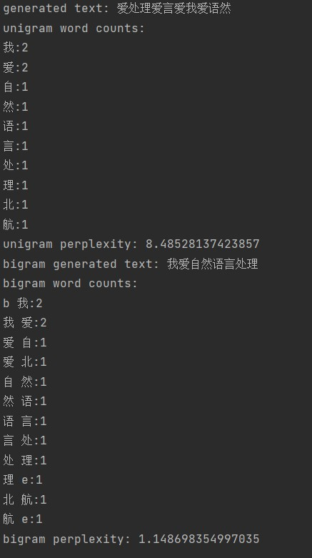

### 3.1

$P(w_n|w_{n-2}w_{n-1})=\frac {C(w_{n-2:n})} {C(w_{n-2:n-1})}$
$$
P(am|<s>\ I)=1/2 \\
P(Sam|I\ am)=1/2 \\
P(</s>|am \ Sam)=1 \\
P(I|<s>\ Sam)=1\\
P(am|Sam\ I)=1\\
P(</s>|I\ am)=1\\
$$
第三句话的所有三元语法的概率全是1，在此略去

### 3.2

`i want chinese food`

#### Non-Smoothing

$$
P(i|<s>)=0.25 \\
P(want|i)=0.33\\
P(chinese|want)=0.0065\\
P(food|chinese)=0.52\\
P(</s>|food)=0.68\\
P(i\ want\ chinese\ food)=0.25*0.33*0.0065*0.52*0.68=0.0001896
$$

#### Add-one Smoothing

$$
P(i|<s>)=0.19 \\
P(want|i)=0.21\\
P(chinese|want)=0.0029\\
P(food|chinese)=0.052\\
P(</s>|food)=0.40\\
P(i\ want\ chinese\ food)=0.19*0.21*0.0029*0.052*0.40=0.000002407
$$

### 3.3

非平滑方法更高

原因是平滑方法需要将一些非0的语法计数分给一些为0的语法，也就是达了折扣，而`i want chinese food`句子中的二元语法都是非0的语法，因此在这样的操作下数值全都降低了，所以最终的概率降低

### 3.4

$|V|=11$ 以下简写为$V$

$N_{am}=3$

$P(Sam|am)=\frac {2+1} {N_{am}+V}=3/14$

### 3.5

$N_{a}=2=N_{b},N_{<s>}=4$

$P(<s>ab)=P(a|<s>)P(b|a)=1/2*1/2=1/4$

$P(<s>ab)=P(<s>ba)=P(<s>aa)=P(<s>bb)$

同理

$P(<s>aba)=1/2*1/2*1/2=1/8$ 其他的也是1/8

### 3.6

$P(w3|w1,w2)=\frac {c(w_1,w_2,w_3)+1} {c(w_1,w_2)+V}$

### 3.7

$P(Sam|am)=\frac 1 2*\frac 3 {14}+\frac 1 2*\frac 4 {25}=0.1871$

### 3.8-3.11

### 3.12

$H(W)=-\frac 1 {10} \log_2 0.91^{9}*0.01=0.5454$

$Perplexity(W)=2^{H(W)}=1.4594$
