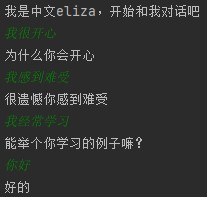
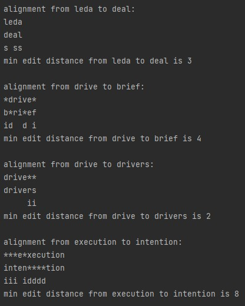

### 2.1

1. `/[a-zA-Z]+/`
2. `/[a-z]*b/`
3. `/(b+a)*b+/`

### 2.2

1. `/(\w+)\s\1/`
2. `/^\d+.*\s\w+$/`
3. `/.*\s(raven\s.*\sgrotto|grotto\s.*\sraven)\s.*/`
4. `/([,.?!;:/'"-()\[\]]|\.\.\.)*(\w+)([\s,.?!;:/'"-()\[\]]|\.\.\.).*/`

注：

* 第2题`.*`效率比`.*?`效率高

### 2.3

参见`slpkiller/Eliza.py`的代码实现，结果如下:

### 2.4-2.7

参见`slpkiller/MinEditDistance.py`的代码实现，结果如下

